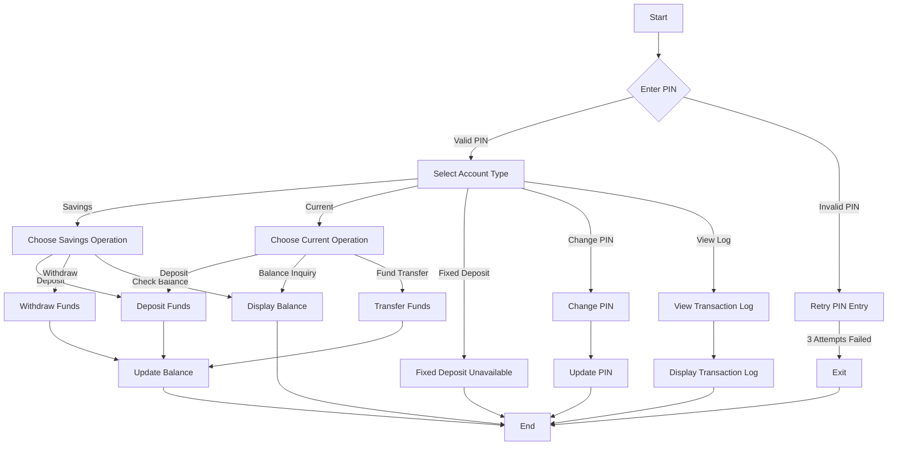

# ATM Banking System

This project presents a Python-based ATM Banking System designed to replicate essential banking operations. The system utilizes MySQL for database management, enabling efficient handling of transaction records and account balances.

---

## Key Features

- **PIN Authentication**: Users must provide a valid 4-digit PIN to access the system.
- **Account Types**: Supports Savings, Current, and Fixed Deposit accounts.
- **Functionalities**:
  - Deposit Funds
  - Withdraw Funds
  - Check Balance
  - Transfer Funds
  - View Transaction Logs
  - Change PIN
- **Error Handling**: Implements robust input validation and safeguards against invalid PIN entries and insufficient funds.

---

## Prerequisites

To run the system, ensure the following requirements are met:

1. **Python**: Install Python version 3.x or higher.
2. **MySQL Database**:
   - A MySQL server should be running locally.
   - Create a database named `atm` with the following `transaction` table:
     ```sql
     CREATE TABLE transaction (
         id INT AUTO_INCREMENT PRIMARY KEY,
         transaction_type VARCHAR(50),
         amount DECIMAL(10,2),
         current_balance DECIMAL(10,2),
         time_stamp DATETIME
     );
     ```
3. **Python Libraries**:
   - `mysql.connector`
   - `sqlalchemy`

Install the required libraries using pip:
```bash
pip install mysql-connector-python sqlalchemy
```

---

## Steps to Execute

1. Clone the project repository.
2. Update the database connection details in the script:
   ```python
   con = mysql.connector.connect(
       host='127.0.0.1',
       user='root',
       password='root',
       database='atm'
   )
   ```
3. Execute the script by running:
   ```bash
   python atm.py
   ```
4. Follow the interactive prompts displayed on the terminal to perform various operations.

---

## System Flowchart



---

## Potential Enhancements

- **Expand Functionality**: Add support for Fixed Deposit account operations.
- **Improve User Interface**: Develop a graphical user interface (GUI) or web-based platform.
- **Enhance Security**: Introduce encryption for sensitive data like PINs and account details.

---

## Licensing

This project is distributed under the MIT License.

